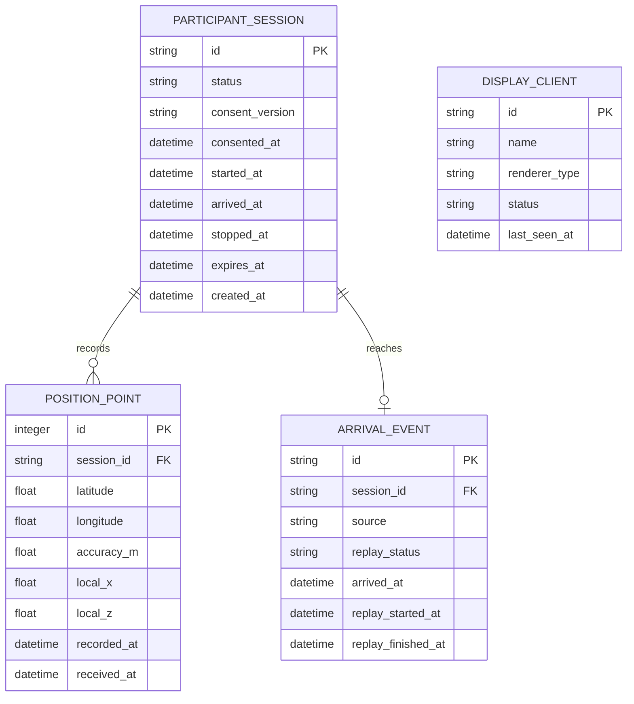

# データモデル

## 方針

- 個人名、学籍番号、メールアドレス、端末固有IDを保存しない
- 参加者はランダムな匿名セッションIDで識別する
- 生の位置点は作品に必要な期間だけ保持する
- 軌跡は位置点から生成し、MVPでは独立テーブルとして重複保存しない
- セッション削除時に関連する位置点と到着イベントを削除する

## ER図

`DISPLAY_CLIENT`は参加者データと関連付けない。描画機の接続監視だけに使用する。

## ParticipantSession

参加開始から追跡終了までの匿名セッション。

| 項目 | 型 | 必須 | 内容 |
|---|---|---:|---|
| `id` | UUID / ULID | Yes | 推測困難な匿名ID |
| `status` | enum | Yes | 状態遷移仕様に従う |
| `consent_version` | string | Yes | 表示した同意文のバージョン |
| `consented_at` | datetime | Yes | 同意時刻 |
| `started_at` | datetime | Yes | 追跡開始時刻 |
| `arrived_at` | datetime | No | 展示場到着時刻 |
| `stopped_at` | datetime | No | 追跡終了時刻 |
| `expires_at` | datetime | Yes | 自動失効・削除判定時刻 |

セッション操作にはIDとは別のランダムな参加トークンを使用する。トークンは平文保存せず、ハッシュだけを保持する。

## PositionPoint

端末から受信し、検証を通過した位置点。キャンパス外や明らかな異常値は保存しない。

| 項目 | 型 | 内容 |
|---|---|---|
| `latitude` / `longitude` | float | WGS84座標 |
| `accuracy_m` | float | ブラウザが返す推定誤差 |
| `local_x` / `local_z` | float | 3D空間用の変換後座標 |
| `recorded_at` | datetime | 端末で取得した時刻 |
| `received_at` | datetime | Goが受信した時刻 |

## ArrivalEvent

到着はセッションにつき最大1件とする。二重送信は同じ結果を返す。

- `source`: `qr`、`nfc`、`operator`
- `replay_status`: `queued`、`playing`、`completed`、`skipped`

## インデックス

- `position_points(session_id, recorded_at)`
- `participant_sessions(status, expires_at)`
- `arrival_events(replay_status, arrived_at)`
- `display_clients(last_seen_at)`

## 削除

1. `expires_at`を過ぎたセッションを定期ジョブが抽出する
2. 位置点、到着イベント、トークンハッシュをトランザクション内で削除する
3. 個人を復元できない集計値だけを残す場合は、大学への説明と同意文へ明記する

