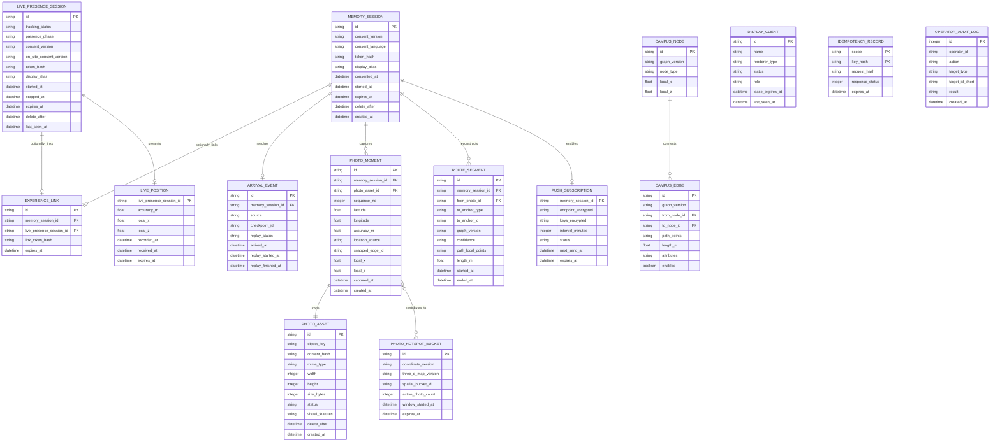

# データモデル

## 方針

- 個人名、学籍番号、メールアドレス、端末固有IDを保存しない
- 写真用MemorySessionとリアルタイム用LivePresenceSessionを別ID・別トークン・別同意版で管理する
- 両体験を同じ端末で使う場合だけ、短期のExperienceLinkで色・記号と到着処理を連携する
- 通常GPSの生緯度経度と点列は永続化せず、量子化済みの最新表示位置だけを30〜60秒保持する
- 写真撮影時GPSはPhotoMomentのアンカーとして写真と同じ期限まで保持する
- 追跡状態と到着演出状態を分離し、一つの状態値に混在させない
- セッションの追跡失効時刻と、保存データの削除時刻を分離する

## ER図

```mermaid
erDiagram
    MEMORY_SESSION ||--o| EXPERIENCE_LINK : optionally_links
    LIVE_PRESENCE_SESSION ||--o| EXPERIENCE_LINK : optionally_links
    LIVE_PRESENCE_SESSION ||--o| LIVE_POSITION : presents
    MEMORY_SESSION ||--o| ARRIVAL_EVENT : reaches
    MEMORY_SESSION ||--o{ PHOTO_MOMENT : captures
    MEMORY_SESSION ||--o{ ROUTE_SEGMENT : reconstructs
    MEMORY_SESSION ||--o| PUSH_SUBSCRIPTION : enables
    PHOTO_MOMENT ||--|| PHOTO_ASSET : owns
    PHOTO_MOMENT }o--o{ PHOTO_HOTSPOT_BUCKET : contributes_to
    CAMPUS_NODE ||--o{ CAMPUS_EDGE : connects

    MEMORY_SESSION {
        string id PK
        string consent_version
        string consent_language
        string token_hash
        string display_alias
        datetime consented_at
        datetime started_at
        datetime expires_at
        datetime delete_after
        datetime created_at
    }

    LIVE_PRESENCE_SESSION {
        string id PK
        string tracking_status
        string presence_phase
        string consent_version
        string on_site_consent_version
        string token_hash
        string display_alias
        datetime started_at
        datetime stopped_at
        datetime expires_at
        datetime delete_after
        datetime last_seen_at
    }

    EXPERIENCE_LINK {
        string id PK
        string memory_session_id FK
        string live_presence_session_id FK
        string link_token_hash
        datetime expires_at
    }

    LIVE_POSITION {
        string live_presence_session_id PK
        float accuracy_m
        float local_x
        float local_z
        datetime recorded_at
        datetime received_at
        datetime expires_at
    }

    PUSH_SUBSCRIPTION {
        string memory_session_id PK
        string endpoint_encrypted
        string keys_encrypted
        integer interval_minutes
        string status
        datetime next_send_at
        datetime expires_at
    }

    ARRIVAL_EVENT {
        string id PK
        string memory_session_id FK
        string source
        string checkpoint_id
        string replay_status
        datetime arrived_at
        datetime replay_started_at
        datetime replay_finished_at
    }

    PHOTO_MOMENT {
        string id PK
        string memory_session_id FK
        string photo_asset_id FK
        integer sequence_no
        float latitude
        float longitude
        float accuracy_m
        string location_source
        string snapped_edge_id
        float local_x
        float local_z
        datetime captured_at
        datetime created_at
    }

    PHOTO_ASSET {
        string id PK
        string object_key
        string content_hash
        string mime_type
        integer width
        integer height
        integer size_bytes
        string status
        string visual_features
        datetime delete_after
        datetime created_at
    }

    ROUTE_SEGMENT {
        string id PK
        string memory_session_id FK
        string from_photo_id FK
        string to_anchor_type
        string to_anchor_id
        string graph_version
        string confidence
        string path_local_points
        float length_m
        datetime started_at
        datetime ended_at
    }

    PHOTO_HOTSPOT_BUCKET {
        string id PK
        string coordinate_version
        string three_d_map_version
        string spatial_bucket_id
        integer active_photo_count
        datetime window_started_at
        datetime expires_at
    }

    CAMPUS_NODE {
        string id PK
        string graph_version
        string node_type
        float local_x
        float local_z
    }

    CAMPUS_EDGE {
        string id PK
        string graph_version
        string from_node_id FK
        string to_node_id FK
        string path_points
        float length_m
        string attributes
        boolean enabled
    }

    DISPLAY_CLIENT {
        string id PK
        string name
        string renderer_type
        string status
        string role
        datetime lease_expires_at
        datetime last_seen_at
    }

    IDEMPOTENCY_RECORD {
        string scope PK
        string key_hash PK
        string request_hash
        integer response_status
        datetime expires_at
    }

    OPERATOR_AUDIT_LOG {
        integer id PK
        string operator_id
        string action
        string target_type
        string target_id_short
        string result
        datetime created_at
    }
```

`DISPLAY_CLIENT`は参加者データと関連付けない。描画機の接続監視だけに使用する。

`IDEMPOTENCY_RECORD`は到着、停止、削除、描画完了の重複適用を防ぐ。キーそのものではなくハッシュ、操作スコープ、リクエスト内容のハッシュ、返却結果、有効期限を最大24時間保存する。同じキーで異なる内容が来た場合は競合として拒否する。削除操作では位置やセッション内容を持たない削除済み記録だけを残し、同じキーの再送へ同じ結果を返す。

`OPERATOR_AUDIT_LOG`は受付停止、再生、skip、fallbackなどの運営操作を記録する。生位置、参加トークン、完全な軌跡を含めず、対象IDも運営上必要な短縮表現にする。

## MemorySession

写真、写真撮影時GPS、経路、到着演出、本人用ストーリーを管理する。LivePresenceSessionとは別の同意版、トークン、削除期限を持つ。

## LivePresenceSession

通常GPSのベストエフォート表示だけを管理する。

- `tracking_status`: `tracking`、`stopped`、`expired`
- `presence_phase`: `approaching`、`arrived`、`on_site`、`ended`
- `on_site_consent_version`: 到着後に用途・範囲が変わる場合だけ必須
- `display_alias`: MemorySessionと共有する場合もExperienceLink経由で短期連携する

## ExperienceLink

同じ端末で両展示へ参加する場合だけ作る短期レコード。色・記号と到着処理を連携するが、写真、生GPS、経路を持たない。片方の削除、到着、期限切れから24時間以内の最短時点で削除する。

## LivePosition

LivePresenceSessionごとに最大1件の最新表示位置を持つ。受信した生緯度経度はgeofence・異常値検証と座標変換後に破棄する。

| 項目 | 型 | 内容 |
|---|---|---|
| `accuracy_m` | float | ブラウザが返す推定誤差 |
| `local_x` / `local_z` | float | 量子化・ぼかし済みの表示座標 |
| `recorded_at` | datetime | 端末で取得した時刻 |
| `received_at` | datetime | Backendが受信した時刻 |
| `expires_at` | datetime | 30〜60秒後の失効時刻 |

## ArrivalEvent

到着はセッションにつき最大1件とする。二重送信は同じ結果を返す。

- `source`: `qr`、`nfc`、`operator`
- `replay_status`: `queued`、`playing`、`completed`、`skipped`
- `checkpoint_id`: 到着場所の識別子。署名付き証明そのものは保存しない
- `skip_reason`: `participant_request`、`timeout`、`renderer_failure`、`operator`

到着の受付ではMemorySessionへArrivalEventを作成し、ExperienceLinkが有効な場合だけ対応するLivePresenceSessionの`presence_phase`を`arrived`へ更新する。LivePresenceSessionのGPS送信は自動停止せず、参加者が停止するか、追加同意して`on_site`へ進む。再生状態はArrivalEventだけを正とし、MemorySessionへ`replaying`を重複保存しない。

## PhotoMoment・PhotoAsset

`PhotoMoment`は参加者が残した撮影イベント、`PhotoAsset`は非公開オブジェクトストレージ上の加工済み画像を表す。写真EXIFは保存せず、撮影時位置はブラウザの位置APIから別項目として受け取る。

| 項目 | 内容 |
|---|---|
| `sequence_no` | セッション内の撮影順。unique |
| `location_source` | `captured_gps`、`interpolated`、`unknown` |
| `snapped_edge_id` | map matchingで採用したCampusEdge。未確定ならnull |
| `object_key` | 推測困難な非公開オブジェクトキー。URLではない |
| `content_hash` | アップロード重複・破損検出用。公開しない |
| `status` | `pending`、`ready`、`failed`、`deleting` |
| `visual_features` | 公開表現に使う復元性の低い主要色等。画像内容の人物・物体分類は行わない |
| `delete_after` | セッション削除期限以下。独立して延長しない |

写真は1セッション12枚までを暫定上限とする。原画像をそのまま保存せず、向き補正、EXIF除去、長辺1920px以下への縮小、再エンコード後の画像だけを保存する。写真単位削除では、PhotoMoment、PhotoAsset、派生特徴を削除し、前後のRouteSegmentを再生成または未確定にする。

## RouteSegment

前の写真から次の写真、または最後の写真から到着点までの再構成経路。

- `from_photo_id`: 区間開始のPhotoMoment
- `to_anchor_type`: `photo`または`arrival`
- `to_anchor_id`: 次のPhotoMomentまたはArrivalEvent
- `graph_version`: 使用したCampusGraphの版
- `confidence`: `high`、`medium`、`low`
- `path_local_points`: 表示用のローカル座標列。生緯度経度を含めない

生成時に参照する位置は区間両端の写真撮影時GPSだけとし、通常GPS点列を入力・保存しない。同じ入力と`graph_version`から再生成できるよう、経路生成アルゴリズムの版も設定またはメタデータへ記録する。

## PhotoHotspotBucket

写真撮影地点を5〜10m単位で量子化し、一定時間窓で集計した公開用の非個人データ。個別写真ピンは永続テーブルを持たず、PhotoMomentの準備完了イベントから短時間だけ生成する。

- 個別ピンのペイロードには写真、画像URL、生GPS、セッションID、正確な時刻を含めない
- 個別ピンは15〜30分以内に失効し、少人数時は遅延、追加量子化、短時間表示、非表示のいずれかを適用する
- `active_photo_count`が3件以上のbucketだけをフォトスポットとして公開する
- 写真単位またはMemorySession全体の削除時は寄与数を減算し、3件未満になれば直ちに公開を止める
- `coordinate_version`、`three_d_map_version`が公開中の組み合わせと一致しないイベントは描画しない

## PushSubscription

MemorySessionに紐づく任意参加の撮影リマインダー。ブラウザの購読エンドポイントと鍵は暗号化し、通知本文に場所、写真、参加記号、経路を含めない。到着、停止、購読解除、期限切れの最も早い時点で無効化・削除する。通知時刻は厳密な保証をせず、端末内タイマーを補助表示として使える。

## CampusNode・CampusEdge

キャンパス内の歩行可能経路を表すバージョン付きグラフ。CampusEdgeは距離、屋内外、階段、スロープ、エレベーター、利用時間、通行止め、バリアフリー可否を属性として持つ。公開中のグラフを直接上書きせず、新しい版を検証してから切り替える。

## インデックス

- `memory_sessions(delete_after)`
- `live_presence_sessions(tracking_status, presence_phase, expires_at)`
- `live_presence_sessions(delete_after)`
- `experience_links(memory_session_id)` unique
- `experience_links(live_presence_session_id)` unique
- `experience_links(expires_at)`
- `live_positions(expires_at)`
- `arrival_events(replay_status, arrived_at)`
- `photo_moments(memory_session_id, sequence_no)` unique
- `photo_moments(photo_asset_id)` unique
- `photo_assets(delete_after, status)`
- `route_segments(memory_session_id, started_at)`
- `photo_hotspot_buckets(coordinate_version, three_d_map_version, spatial_bucket_id, window_started_at)` unique
- `photo_hotspot_buckets(expires_at)`
- `push_subscriptions(status, next_send_at)`
- `campus_nodes(graph_version)`
- `campus_edges(graph_version, enabled)`
- `display_clients(last_seen_at)`
- `idempotency_records(scope, key_hash)` unique
- `idempotency_records(expires_at)`
- `operator_audit_logs(created_at)`

## 削除

1. LivePresenceSessionの`expires_at`到来時は`expired`にし、LivePosition、トークン、対応するExperienceLinkを削除する
2. MemorySessionの`delete_after`到来時は、写真、経路、到着、PushSubscription、トークン、対応するExperienceLinkを削除対象にする
3. 写真が寄与したPhotoHotspotBucketを減算し、公開条件を下回ったbucketを非公開にする
4. 非公開オブジェクトストレージ上の写真を削除し、成功を確認する
5. DBレコードをトランザクション内で削除する。オブジェクト削除失敗時は`deleting`として再試行し、期限超過をアラートする
6. 参加者画面は「写真の思い出を削除」「リアルタイム参加を削除」「両方を削除」を分け、両方の場合も各削除を独立に完了・再試行できるようにする
7. 個人を復元できない集計値だけを残す場合は、大学への説明と同意文へ明記する

インフラのセキュリティログとバックアップはDB削除と同時に個別レコードを消せない場合があるため、原則として生位置を含めず、別途定めた短い保持期限で世代ごと削除する。
