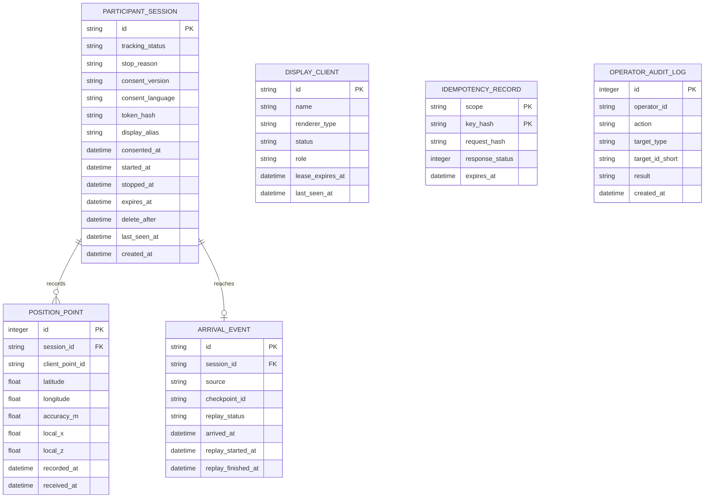

# データモデル

## 方針

- 個人名、学籍番号、メールアドレス、端末固有IDを保存しない
- 参加者はランダムな匿名セッションIDで識別する
- 生の位置点は承認済みの`delete_after`まで保持し、暫定上限は到着・停止後24時間とする
- 軌跡は位置点から生成し、MVPでは独立テーブルとして重複保存しない
- セッション削除時に関連する位置点と到着イベントを削除する
- 追跡状態と到着演出状態を分離し、一つの状態値に混在させない
- セッションの追跡失効時刻と、保存データの削除時刻を分離する

## ER図

```mermaid
erDiagram
    PARTICIPANT_SESSION ||--o{ POSITION_POINT : records
    PARTICIPANT_SESSION ||--o| ARRIVAL_EVENT : reaches

    PARTICIPANT_SESSION {
        string id PK
        string tracking_status
        string stop_reason
        string consent_version
        string consent_language
        string token_hash
        string display_alias
        datetime consented_at
        datetime started_at
        datetime stopped_at
        datetime expires_at
        datetime delete_after
        datetime last_seen_at
        datetime created_at
    }

    POSITION_POINT {
        integer id PK
        string session_id FK
        string client_point_id
        float latitude
        float longitude
        float accuracy_m
        float local_x
        float local_z
        datetime recorded_at
        datetime received_at
    }

    ARRIVAL_EVENT {
        string id PK
        string session_id FK
        string source
        string checkpoint_id
        string replay_status
        datetime arrived_at
        datetime replay_started_at
        datetime replay_finished_at
    }

    DISPLAY_CLIENT {
        string id PK
        string name
        string renderer_type
        string status
        string role
        datetime lease_expires_at
        datetime last_seen_at
    }

    IDEMPOTENCY_RECORD {
        string scope PK
        string key_hash PK
        string request_hash
        integer response_status
        datetime expires_at
    }

    OPERATOR_AUDIT_LOG {
        integer id PK
        string operator_id
        string action
        string target_type
        string target_id_short
        string result
        datetime created_at
    }
```

`DISPLAY_CLIENT`は参加者データと関連付けない。描画機の接続監視だけに使用する。

`IDEMPOTENCY_RECORD`は到着、停止、削除、描画完了の重複適用を防ぐ。キーそのものではなくハッシュ、操作スコープ、リクエスト内容のハッシュ、返却結果、有効期限を最大24時間保存する。同じキーで異なる内容が来た場合は競合として拒否する。削除操作では位置やセッション内容を持たない削除済み記録だけを残し、同じキーの再送へ同じ結果を返す。

`OPERATOR_AUDIT_LOG`は受付停止、再生、skip、fallbackなどの運営操作を記録する。生位置、参加トークン、完全な軌跡を含めず、対象IDも運営上必要な短縮表現にする。

## ParticipantSession

参加開始から追跡終了までの匿名セッション。

| 項目 | 型 | 必須 | 内容 |
|---|---|---:|---|
| `id` | UUID / ULID | Yes | 推測困難な匿名ID |
| `tracking_status` | enum | Yes | `tracking`、`stopped`、`expired` |
| `stop_reason` | enum | No | `arrival`、`participant_request`、`operator` |
| `consent_version` | string | Yes | 表示した同意文のバージョン |
| `consent_language` | string | Yes | 同意文を表示した言語 |
| `token_hash` | string | Yes | 参加トークンのハッシュ |
| `display_alias` | string / JSON | Yes | 非識別の色・記号。混雑中は重複を避ける |
| `consented_at` | datetime | Yes | 同意時刻 |
| `started_at` | datetime | Yes | 追跡開始時刻 |
| `stopped_at` | datetime | No | 追跡終了時刻 |
| `expires_at` | datetime | Yes | セッションと参加トークンの自動失効時刻 |
| `delete_after` | datetime | Yes | 関連データの自動削除期限。作成時は上限、停止時に保持期間に基づき前倒しする |
| `last_seen_at` | datetime | No | 最後に認証済み要求を受けた時刻。運営上の接続判定用 |

セッション操作にはIDとは別のランダムな参加トークンを使用する。トークンは平文保存せず、ハッシュだけを保持する。

## PositionPoint

端末から受信し、検証を通過した位置点。キャンパス外や明らかな異常値は保存しない。

| 項目 | 型 | 内容 |
|---|---|---|
| `client_point_id` | string | 端末が生成するセッション内一意ID |
| `latitude` / `longitude` | float | WGS84座標 |
| `accuracy_m` | float | ブラウザが返す推定誤差 |
| `local_x` / `local_z` | float | 3D空間用の変換後座標 |
| `recorded_at` | datetime | 端末で取得した時刻 |
| `received_at` | datetime | Goが受信した時刻 |

## ArrivalEvent

到着はセッションにつき最大1件とする。二重送信は同じ結果を返す。

- `source`: `qr`、`nfc`、`operator`
- `replay_status`: `queued`、`playing`、`completed`、`skipped`
- `checkpoint_id`: 到着場所の識別子。署名付き証明そのものは保存しない
- `skip_reason`: `participant_request`、`timeout`、`renderer_failure`、`operator`

到着の受付とParticipantSessionの追跡停止は同じトランザクションで行う。再生状態はArrivalEventだけを正とし、ParticipantSessionへ`arrived`や`replaying`を重複保存しない。

## インデックス

- `position_points(session_id, recorded_at)`
- `position_points(session_id, client_point_id)` unique
- `participant_sessions(tracking_status, expires_at)`
- `participant_sessions(delete_after)`
- `arrival_events(replay_status, arrived_at)`
- `display_clients(last_seen_at)`
- `idempotency_records(scope, key_hash)` unique
- `idempotency_records(expires_at)`
- `operator_audit_logs(created_at)`

## 削除

1. `expires_at`を過ぎたセッションは追跡を`expired`にし、トークンを無効化する
2. `delete_after`を過ぎたセッションを定期ジョブが抽出する
3. 位置点、到着イベント、セッション、トークンハッシュをトランザクション内で削除する
4. 参加者による即時削除も同じ削除処理を使用する
5. 個人を復元できない集計値だけを残す場合は、大学への説明と同意文へ明記する

インフラのセキュリティログとバックアップはDB削除と同時に個別レコードを消せない場合があるため、原則として生位置を含めず、別途定めた短い保持期限で世代ごと削除する。
