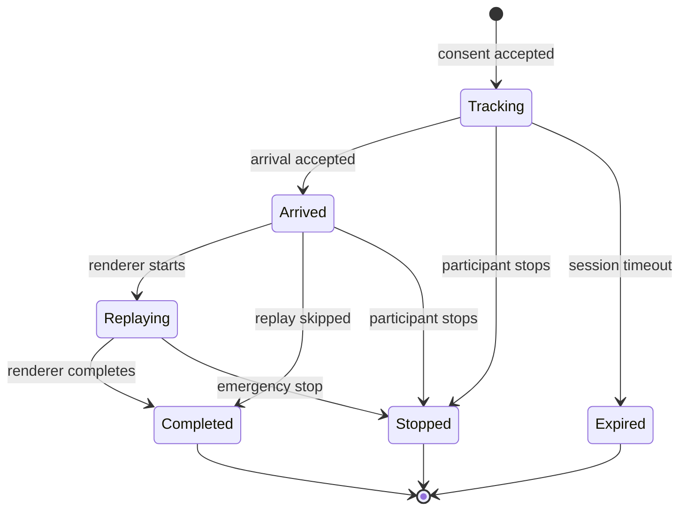

# 参加セッション状態遷移

## 状態図

端末の通信切断は永続状態にしない。`last_seen_at`から運営画面が `degraded` と判定し、再接続時は同じセッションを継続する。

## 状態

| 状態 | 内容 | 位置点受付 |
|---|---|---:|
| `tracking` | 同意済みで追跡中 | Yes |
| `arrived` | 到着済み、再生待ち | No |
| `replaying` | 軌跡演出中 | No |
| `completed` | 通常終了 | No |
| `stopped` | 参加者または運営による停止 | No |
| `expired` | 時間切れ | No |

## 遷移ルール

| 現在 | イベント | 次 | サーバー処理 |
|---|---|---|---|
| - | `session.created` | `tracking` | トークンと失効時刻を発行 |
| `tracking` | `participant.arrived` | `arrived` | 最終位置を保存し到着キューへ追加 |
| `tracking` | `tracking.stop` | `stopped` | 以降の位置点を拒否 |
| `tracking` | `session.expire` | `expired` | トークンを無効化 |
| `arrived` | `replay.started` | `replaying` | 描画機と開始時刻を記録 |
| `arrived` | `replay.skipped` | `completed` | スキップ理由を記録 |
| `replaying` | `replay.completed` | `completed` | 完了時刻を記録 |

## 冪等性

- 到着済みセッションへの到着要求は既存の`ArrivalEvent`を返す
- 停止済みセッションへの停止要求は成功として現在状態を返す
- 同じ`eventId`の描画完了通知は1回だけ適用する
- 終端状態から別の状態へ戻さない

## 異常系

- 描画機が接続されていない場合も到着を受け付け、キューへ保持する
- 一定時間再生を開始できなければ `skipped` とし、通常展示を継続する
- 端末時刻が不正でもサーバー受信時刻を使って停止・到着を確定できる

