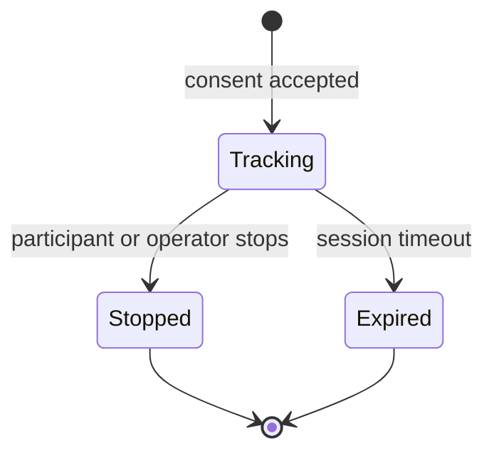
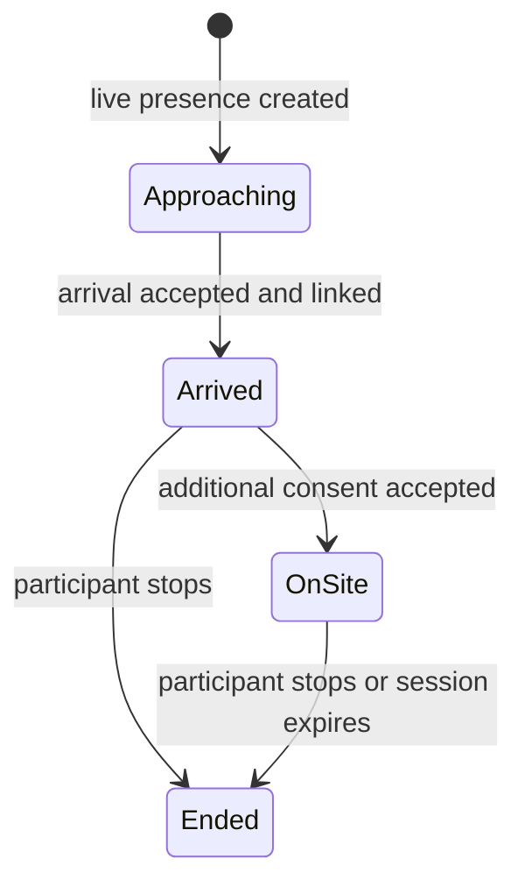
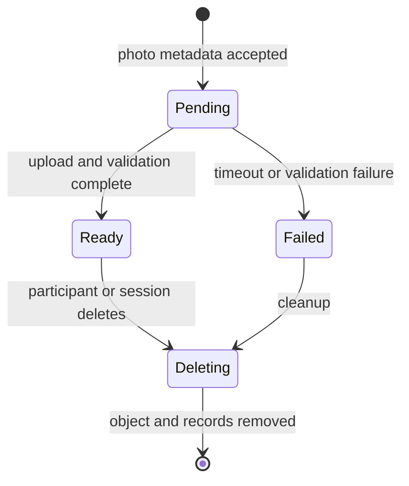
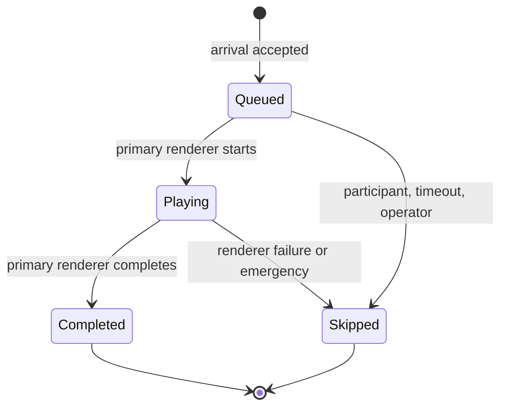

# 参加追跡・到着演出の状態遷移

## 分離方針

写真の思い出、リアルタイム位置、会場内フェーズ、到着演出は別の関心事として管理する。到着は演出を開始するが、リアルタイム位置を自動停止しない。

- `LivePresenceSession.tracking_status`: 通常GPSの最新値を受け付けるか
- `LivePresenceSession.presence_phase`: 来場前、到着、会場内、終了のどこか
- `PhotoAsset.status`: 写真の送信・検証・削除状態
- `ArrivalEvent.replay_status`: 到着演出がどこまで進んだか

通信切断は永続状態にしない。`last_seen_at`から運営画面が`degraded`と判定し、再接続時は有効期限内の同じセッションを継続する。

## 追跡状態

```mermaid
stateDiagram-v2
    [*] --> Tracking: consent accepted
    Tracking --> Stopped: participant or operator stops
    Tracking --> Expired: session timeout
    Stopped --> [*]
    Expired --> [*]
```

| 状態 | 内容 | 位置点受付 |
|---|---|---:|
| `tracking` | 同意済みで追跡中 | Yes |
| `stopped` | 参加者、運営の操作により停止 | No |
| `expired` | 追跡上限を過ぎて失効 | No |

| 現在 | イベント | 次 | サーバー処理 |
|---|---|---|---|
| - | `live_presence.created` | `tracking` | 専用トークン、追跡失効、削除期限を発行 |
| `tracking` | `tracking.stop` | `stopped` | `stop_reason`を記録し、以降の位置点を拒否 |
| `tracking` | `live_presence.expire` | `expired` | トークンを無効化し、以降の位置点を拒否 |

## 会場内フェーズ

```mermaid
stateDiagram-v2
    [*] --> Approaching: live presence created
    Approaching --> Arrived: arrival accepted and linked
    Arrived --> OnSite: additional consent accepted
    Arrived --> Ended: participant stops
    OnSite --> Ended: participant stops or session expires
```

- `approaching`: 展示場へ来る前。最新位置をキャンパス展示へ使う
- `arrived`: 到着済み。撮影通知は終了するが、通常GPSの停止・会場内継続を選べる
- `on_site`: 用途・粒度を示した追加同意後。原則エリア表示とし、精度不足時は操作時だけの表示へ落とす
- `ended`: 表示終了。最新位置を削除する

ExperienceLinkがない場合、MemorySessionの到着はLivePresenceSessionへ影響しない。`on_site`への遷移は到着QRだけでは行わず、追加同意版を必須にする。

## 写真状態

```mermaid
stateDiagram-v2
    [*] --> Pending: photo metadata accepted
    Pending --> Ready: upload and validation complete
    Pending --> Failed: timeout or validation failure
    Ready --> Deleting: participant or session deletes
    Failed --> Deleting: cleanup
    Deleting --> [*]: object and records removed
```

| 状態 | 内容 |
|---|---|
| `pending` | メタデータ作成済み、画像送信または検証待ち |
| `ready` | 非公開保存と検証が完了し、本人用ストーリーで利用可能 |
| `failed` | 送信期限切れ、形式・容量・EXIF検証失敗 |
| `deleting` | オブジェクトと派生データを削除中 |

- 同じ`clientPhotoId`、ハッシュ、冪等性キーは一つのPhotoMomentへ対応させる
- 画像検証に失敗した場合はオブジェクトを削除し、公開描画イベントを送らない
- 写真単位削除では前後のRouteSegmentを無効化し、残りの写真アンカーから再生成する
- `ready`遷移時に短期の写真ピンを発行し、削除・期限切れ時に消去とフォトスポット減算を発行する
- 到着時に`pending`写真がある場合は暫定15秒待ち、完了しなければその写真を除いて演出を生成する
- 写真0枚・1枚でも到着演出とセッション終了を妨げない

## 到着演出状態

```mermaid
stateDiagram-v2
    [*] --> Queued: arrival accepted
    Queued --> Playing: primary renderer starts
    Queued --> Skipped: participant, timeout, operator
    Playing --> Completed: primary renderer completes
    Playing --> Skipped: renderer failure or emergency
    Completed --> [*]
    Skipped --> [*]
```

| 状態 | 内容 |
|---|---|
| `queued` | 到着済み、再生待ち |
| `playing` | 主描画機が演出中 |
| `completed` | 正常終了 |
| `skipped` | 参加者選択、タイムアウト、障害、運営操作で終了 |

| 現在 | イベント | 次 | サーバー処理 |
|---|---|---|---|
| - | `participant.arrived` | `queued` | 到着証明を検証し、キューへ一度だけ追加 |
| `queued` | `replay.started` | `playing` | 主描画機リースと開始時刻を記録 |
| `queued` | `replay.skipped` | `skipped` | 理由と終了時刻を記録 |
| `playing` | `replay.completed` | `completed` | 完了時刻を記録 |
| `playing` | `replay.failed` | `skipped` | 障害理由を記録し通常展示を継続 |

## 冪等性・競合制御

- 到着済みセッションへの到着要求は既存のArrivalEventを返す
- 停止済みセッションへの停止要求は成功として現在状態を返す
- LivePresenceSessionごとに通常GPSは最新1件だけを上書きし、古い`recordedAt`を拒否する
- 描画機からの同じ`eventId`は一度だけ適用する
- 到着作成と、有効なExperienceLinkを介した`presence_phase=arrived`更新を一つのDBトランザクションで行う
- 演出開始は主描画機リースを持つ一台だけが確定できる
- 終端状態から別の状態へ戻さない

## 削除

削除は状態遷移ではなくデータ消去である。MemorySession削除とLivePresenceSession削除を分け、「両方を削除」では各処理を独立して完了させる。片方を削除した時点でExperienceLinkを削除する。写真オブジェクトの削除を確認し、失敗時は`deleting`として再試行する。削除後は同じトークンで状態を復元できない。同じ削除要求の安全な再送に限り、写真、位置、セッション内容を持たない短期の冪等性記録から成功結果を返す。

## 異常系

- 描画機が接続されていない場合も到着を受け付け、上限内でキューへ保持する
- 設定時間内に再生を開始できなければ`skipped`とし、通常展示を継続する
- 端末時刻が不正でも、到着と停止はサーバー受信時刻を正とする
- 主描画機が再生中に切断した場合は、同じ演出を自動で別端末から再開せず、skipまたは運営承認付き再試行とする
- 参加者が再生前に削除した場合はキューから除外し、描画機へ停止イベントを送る
