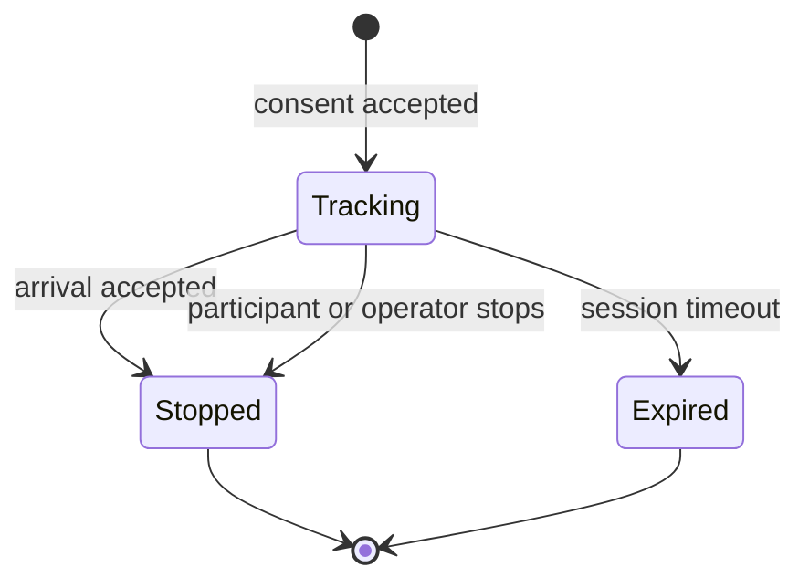
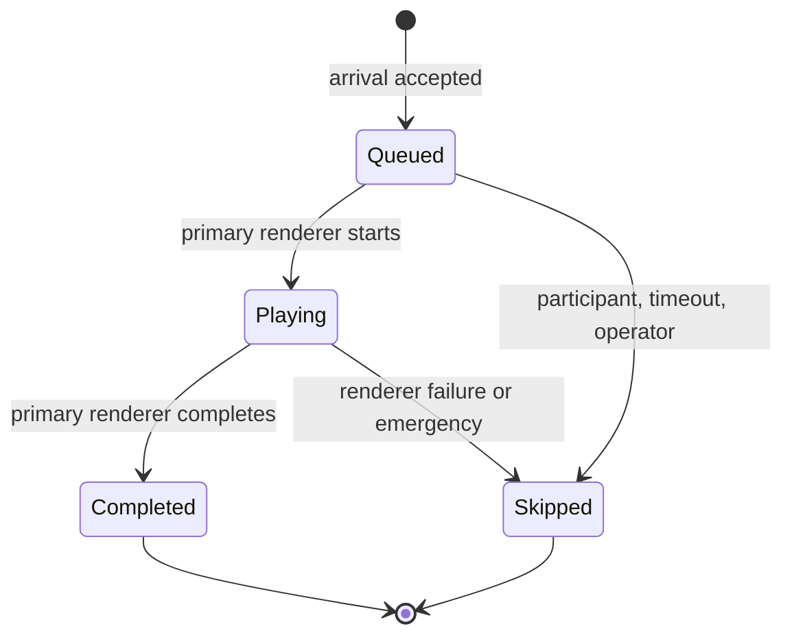

# 参加追跡・到着演出の状態遷移

## 分離方針

追跡の終了と軌跡演出の進行は別の関心事である。到着すると追跡は即座に停止する一方、演出は待機・再生・完了へ進むため、二つの状態機械として管理する。

- `ParticipantSession.tracking_status`: 位置点を受け付けるか
- `ArrivalEvent.replay_status`: 到着演出がどこまで進んだか

通信切断は永続状態にしない。`last_seen_at`から運営画面が`degraded`と判定し、再接続時は有効期限内の同じセッションを継続する。

## 追跡状態

```mermaid
stateDiagram-v2
    [*] --> Tracking: consent accepted
    Tracking --> Stopped: arrival accepted
    Tracking --> Stopped: participant or operator stops
    Tracking --> Expired: session timeout
    Stopped --> [*]
    Expired --> [*]
```

| 状態 | 内容 | 位置点受付 |
|---|---|---:|
| `tracking` | 同意済みで追跡中 | Yes |
| `stopped` | 到着、参加者、運営の操作により停止 | No |
| `expired` | 追跡上限を過ぎて失効 | No |

| 現在 | イベント | 次 | サーバー処理 |
|---|---|---|---|
| - | `session.created` | `tracking` | トークン、追跡失効、削除期限を発行 |
| `tracking` | `participant.arrived` | `stopped` | 最終有効位置を確定し、到着作成と同じトランザクションで停止 |
| `tracking` | `tracking.stop` | `stopped` | `stop_reason`を記録し、以降の位置点を拒否 |
| `tracking` | `session.expire` | `expired` | トークンを無効化し、以降の位置点を拒否 |

## 到着演出状態

```mermaid
stateDiagram-v2
    [*] --> Queued: arrival accepted
    Queued --> Playing: primary renderer starts
    Queued --> Skipped: participant, timeout, operator
    Playing --> Completed: primary renderer completes
    Playing --> Skipped: renderer failure or emergency
    Completed --> [*]
    Skipped --> [*]
```

| 状態 | 内容 |
|---|---|
| `queued` | 到着済み、再生待ち |
| `playing` | 主描画機が演出中 |
| `completed` | 正常終了 |
| `skipped` | 参加者選択、タイムアウト、障害、運営操作で終了 |

| 現在 | イベント | 次 | サーバー処理 |
|---|---|---|---|
| - | `participant.arrived` | `queued` | 到着証明を検証し、キューへ一度だけ追加 |
| `queued` | `replay.started` | `playing` | 主描画機リースと開始時刻を記録 |
| `queued` | `replay.skipped` | `skipped` | 理由と終了時刻を記録 |
| `playing` | `replay.completed` | `completed` | 完了時刻を記録 |
| `playing` | `replay.failed` | `skipped` | 障害理由を記録し通常展示を継続 |

## 冪等性・競合制御

- 到着済みセッションへの到着要求は既存のArrivalEventを返す
- 停止済みセッションへの停止要求は成功として現在状態を返す
- `(session_id, client_point_id)`が同じ位置点は一度だけ適用する
- 描画機からの同じ`eventId`は一度だけ適用する
- 到着取得と追跡停止を一つのDBトランザクションで行う
- 演出開始は主描画機リースを持つ一台だけが確定できる
- 終端状態から別の状態へ戻さない

## 削除

削除は状態遷移ではなくデータ消去である。参加者による削除または`delete_after`到来時に、ParticipantSession、PositionPoint、ArrivalEvent、参加トークンハッシュを削除する。削除後は同じトークンで状態を復元できない。同じ削除要求の安全な再送に限り、位置やセッション内容を持たない短期の冪等性記録から成功結果を返す。

## 異常系

- 描画機が接続されていない場合も到着を受け付け、上限内でキューへ保持する
- 設定時間内に再生を開始できなければ`skipped`とし、通常展示を継続する
- 端末時刻が不正でも、到着と停止はサーバー受信時刻を正とする
- 主描画機が再生中に切断した場合は、同じ演出を自動で別端末から再開せず、skipまたは運営承認付き再試行とする
- 参加者が再生前に削除した場合はキューから除外し、描画機へ停止イベントを送る
