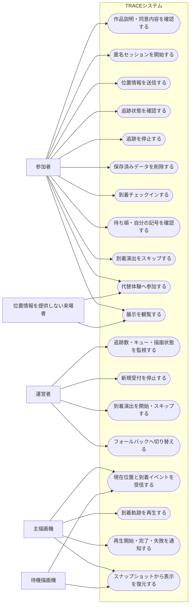
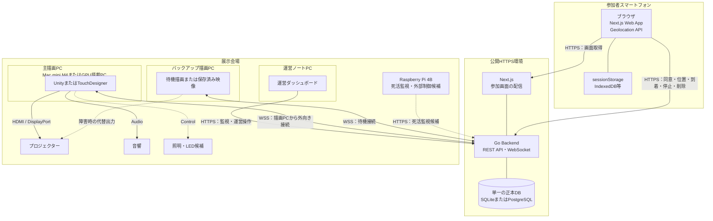
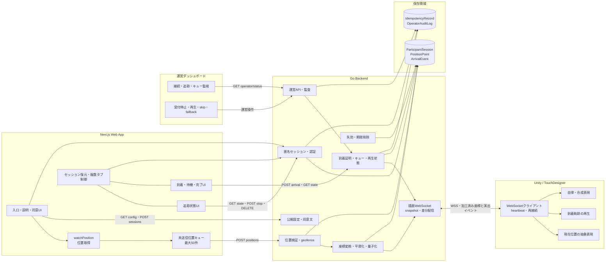
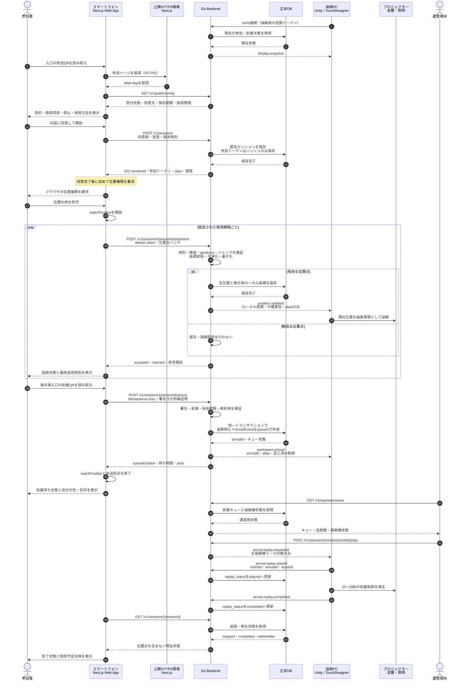
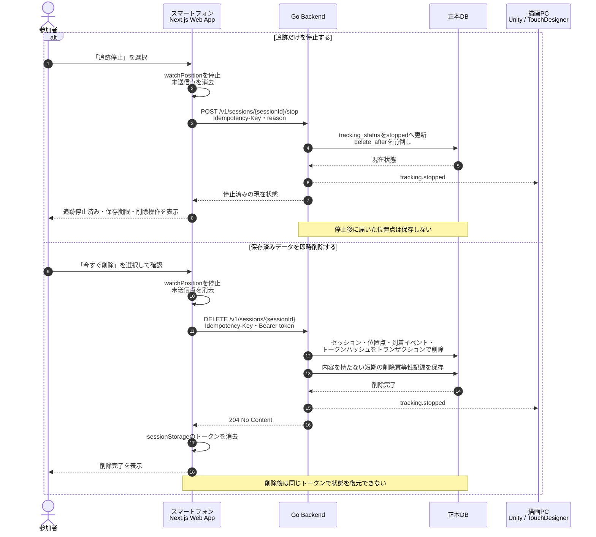
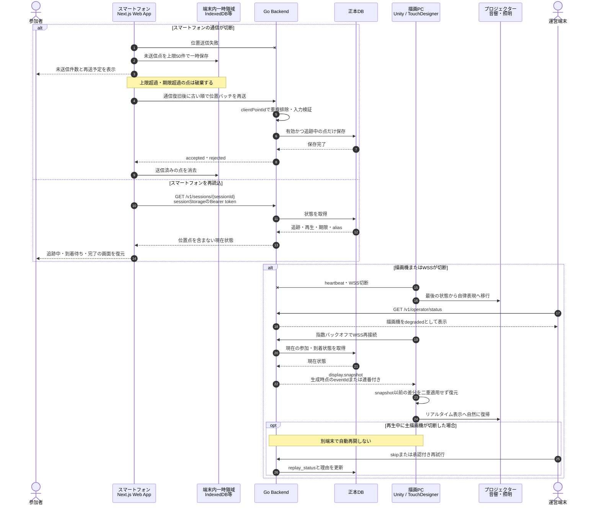

# UML図・システムフロー

この資料は、TRACEの設計書をもとに、利用者、各端末、フロントエンド、バックエンド、DB、描画システムの役割とデータの流れをMermaidで整理したものです。

通信契約は[API・WebSocket仕様](api.md)、状態の正本は[参加追跡・到着演出の状態遷移](state-machine.md)、保存内容は[データモデル](data-model.md)を優先します。実装中に仕様を変更した場合は、該当する設計書と本資料を同じ変更単位で更新します。

## 図の一覧

| 図 | 答える質問 | 優先度 |
|---|---|---:|
| ユースケース図 | 誰が何を操作するのか | 高 |
| 配置図 | どの端末で何が動くのか | 高 |
| コンポーネント図 | 各ソフトウェアが何を担当するのか | 高 |
| シーケンス図 | 端末間でデータがどの順番に流れるのか | 高 |

## ユースケース図

位置情報を提供しない来場者も展示を観覧でき、位置取得不能時はQRチェックポイントまたは合成軌跡による代替参加を利用できる前提です。

### 権限上のポイント

- 参加者、運営者、描画機は別々の資格情報を使用する
- 待機描画機は通常表示とスナップショットを受信できるが、演出完了を確定できない
- 運営操作は運営者だけが実行でき、操作履歴を残す
- 観覧や代替体験に位置情報の同意を必須としない

## 配置図

本番のWeb App、Go Backend、正本DBは公開HTTPS環境へ配置します。会場PC上のBackendは開発・承認済み緊急構成に限定し、本番DBと同時に正本として動かしません。

### 配置上のポイント

- スマートフォンと描画PCは、どちらも公開環境へ外向きに接続する
- 学内ネットワークから描画PCへの受信ポート開放を前提としない
- SQLiteは単一Backendと永続ディスクを使用できる場合のMVP候補とする
- 複数Backendや一時ディスク、無停止切替が必要ならPostgreSQLを使用する
- 主描画PC停止時はバックアップ描画または合成映像へ切り替える

## コンポーネント図

### コンポーネント間の責務

- Web Appは同意、位置取得、参加者への状態表示、停止・削除操作を担当する
- Go Backendは認証、位置検証、座標加工、状態管理、保存、描画配信を担当する
- DBは参加追跡状態と到着演出状態を分けて保存する
- Unity / TouchDesignerは生の緯度経度を受け取らず、表示用データから表現を生成する
- 運営画面は監視と運営操作だけを担当し、生位置を表示しない

## シーケンス図

### 通常参加から到着演出まで

### 参加者による追跡停止・データ削除

追跡停止は新しい位置点を止める操作で、保存済みデータの削除とは分けて扱います。

### 通信断と再接続

## 図と実装で共通に守ること

- 同意完了前にブラウザの位置情報APIを呼び出さない
- 参加トークンをURL、ログ、描画イベントへ含めず、サーバーにはハッシュだけを保存する
- 描画機へ渡すのは加工済みローカル座標であり、生の緯度経度は渡さない
- 到着受付と追跡停止は同じDBトランザクションで処理する
- 追跡状態と到着演出状態は別々に管理する
- 到着、停止、削除、描画完了は冪等に処理する
- 主描画機だけが到着演出の開始・完了を確定できる
- 通信断時は端末内の上限付き保持、描画の自律表現、復旧時のスナップショットを使用する
- 本番の正本DBは一つだけとし、会場PC上のBackendと同時書き込みしない

## 統合前に確認が必要な点

以下は、図の作成時に設計書だけでは一意に判断できなかった点です。図では開発を進められるよう暫定的な流れを置いていますが、担当機能を統合する前に関係者で決定し、API仕様と本資料へ反映してください。

| 確認事項 | 現在の図での暫定解釈 | 統合前に決めること |
|---|---|---|
| 到着演出の開始方法 | 運営者が`POST /v1/operator/arrivals/{arrivalId}/play`を実行して開始する | 毎回手動で開始するか、Backendがキューから自動開始するか |
| `participant.arrived`と`arrival.replay.requested`の役割 | 到着時に`participant.arrived`で加工済み軌跡を渡し、再生時に`arrival.replay.requested`を送る | 軌跡をどちらのイベントへ含めるか、各イベントを受けた描画機が何をするか |
| 参加者画面の状態更新 | 必要なタイミングで`GET /v1/sessions/{sessionId}`を呼び、待ち順・再生完了を取得する | ポーリング間隔、画面更新方法、参加者向けリアルタイム通知を追加するか |
| 追跡停止APIの成功応答 | 状態遷移資料に合わせて、停止済みの現在状態を返す | HTTP statusとresponse bodyの正式な形式 |
| 削除時の描画機通知 | `tracking.stopped`で表示停止とキュー除外を伝える | 削除専用イベントや再生キャンセルイベントが必要か、描画側の消去範囲 |
| 主描画機リース | 主描画機だけが再生開始・完了を送れるものとしている | リースの取得方法、有効時間、更新、切断時の解放、待機機への切替手順 |
| 描画WebSocketの差分復元 | `display.snapshot`のeventIdまたは連番を基準に古い差分を捨てる | 採用するカーソル方式、順序逆転・欠落・再送の処理 |
| 未来時刻の位置点 | 図では「入力検証」とだけ記載し、処理を確定していない | `FUTURE_TIME`として拒否するか、受信時刻へ補正するか。API仕様と座標変換資料で記述が異なる |
| 描画へ渡す誤差情報 | 図では「不確実性」と表記している | `accuracyM`と`uncertaintyM`のどちらを正式名称にするか、生の精度か加工後の値か |
| 到着後の端末内未送信点 | 到着成功後に`watchPosition`と未送信点を終了する | 到着要求と同時に届いた位置バッチの順序、到着失敗時に追跡を継続するか |
| 代替参加の処理 | ユースケースだけに記載し、端末間フローには含めていない | QRチェックポイントのAPI、合成軌跡の生成主体、到着キューへ入れる条件 |
| フロントエンドの配置 | Next.jsとGo Backendを同じ「公開HTTPS環境」に置く | 同一ホスト、別サービス、リバースプロキシ構成のどれにするか |
| 正本DB | 条件に応じてSQLiteまたはPostgreSQLと表記している | 本番で使用するDB、永続ディスク、バックアップ、復旧方法 |
| 描画ソフト | UnityまたはTouchDesignerと併記している | 最終的に使用するソフトと、WebSocketイベントを受け取る実装担当 |
| Raspberry Pi・音響・照明 | 候補または任意接続として点線で表している | MVPに含める範囲、接続方式、障害時に切り離せる条件 |

### 統合時の更新ルール

- 決定した項目は「暫定解釈」のまま残さず、該当する図と設計書へ反映する
- APIまたはイベントを変更した場合は、送信側と受信側の担当者が同じ内容で合意する
- 未決の機能はインターフェースをモック化し、統合時に暗黙の仕様を持ち込まない
- リアルタイム位置の本番利用に関わる未決事項が残る場合は、合成データ表示をフォールバックとする
